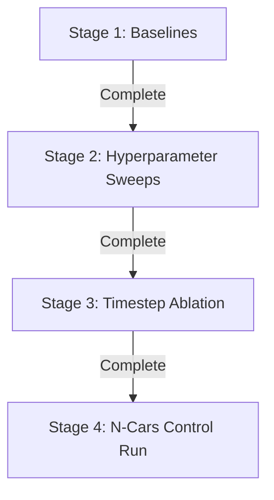

# DelftBlue Experiment Suite - Execution & Script Registry

This document contains the persistent, step-by-step instructions, file structures, and exact commands/scripts to execute all four experiments on the DelftBlue cluster in a self-contained, sequential manner.

---

## 1. Storage & Environment Setup (One-time Setup)

### DelftBlue Quotas & Storage Strategy
- **/home (`/home/ebulboaca`)**: Hard quota of **30 GB** (backed up). Exceeding this quota blocks any new file writes and causes active runs/jobs to crash. Keep all virtual environments, heavy caches, and datasets out of home.
- **/scratch (`/scratch/ebulboaca`)**: Hard limit of **5 TB** (not backed up, subject to periodic purges). This is the correct location for datasets, processed images, checkpoints, and tool caches. All datasets are downloaded directly to this directory (no copying from home needed).

### Environment Preparation (Laptop -> Login Node)
1. **Laptop — Sync code to DelftBlue login node**:
   ```bash
   ./eugen/sync_to_delftblue.sh ebulboaca
   ```
   *(Note: `eugen/` is the name of the local subfolder containing the scripts and job templates, which is copied to the cluster. Your NetID on the cluster is `ebulboaca`.)*

2. **SSH into the login node**:
   ```bash
   ssh ebulboaca@login.delftblue.tudelft.nl
   ```

3. **Traverse to project directory**:
   ```bash
   cd ~/EMS-YOLO
   ```
   *(Note: The sync script automatically creates this project directory on the cluster home directory during the rsync process, so it will exist upon successful sync.)*

4. **Install `uv` (on the login node only)**:
   ```bash
   curl -LsSf https://astral.sh/uv/install.sh | sh
   source ~/.bashrc
   ```
   *(Note: This installs `uv` strictly locally in your user directory under `~/.local/bin/uv`. It does not make any global changes and does not affect other users.)*

5. **Relocate `uv` cache to scratch**:
   ```bash
   mkdir -p /scratch/$USER/uv-cache
   echo 'export UV_CACHE_DIR=/scratch/$USER/uv-cache' >> ~/.bashrc
   source ~/.bashrc
   ```
   *(Note: This is only relocating the package manager's library download cache to avoid filling up the 30 GB home directory quota. Large datasets are downloaded directly to `/scratch` in the first place, never downloaded to home.)*

6. **Create the datasets scratch directory and symlink**:
   ```bash
   mkdir -p /scratch/$USER/datasets
   ln -sfn /scratch/$USER/datasets ./datasets
   ```

7. **Create the `slurm_logs/` folder to prevent output loss**:
   ```bash
   mkdir -p slurm_logs
   ```

8. **Build virtual environment**:
   ```bash
   uv sync
   ```

---

## 2. Dataset Setup (One-time Setup on Login Node)

Download and prepare all datasets (COCO, pre-computed Gen1, and raw N-Cars) prior to starting the experiments.

### Run Download Manager Script:
```bash
bash eugen/download_datasets.sh
```

- **COCO 2017 val set & weights**: Automatically downloaded and placed in `/scratch/$USER/datasets/coco` and `runs/train/exp/weights`.
- **Gen1 Pre-computed Dataset**: Automatically downloaded using the direct kDrive link.
- **N-Cars Dataset**: Automatically downloaded using the direct kDrive link.


### N-Cars Preprocessing:
Convert raw classification event files into frame tensors (`.npy`) and labels (`.txt`) for detection training:
```bash
uv run eugen/get_ncars_data.py --path /scratch/$USER/datasets/ncars_raw --outpath /scratch/$USER/datasets/ncars_processed -T 5
```

---

## 3. Sequential Execution Stages

Compute jobs for each stage run in parallel, and their outputs are isolated on scratch to prevent collisions.



### Stage 1: Baseline Reproduction

Runs Gen1 baseline training (T=5, 50 epochs) on 2 GPUs in parallel with COCO validation (inference only) on 1 GPU.

1. **Submit Jobs**:
   ```bash
   sbatch eugen/run_exp1_baseline.sbatch
   sbatch eugen/run_val_coco.sbatch
   ```
2. **Output Locations**:
   - Gen1 Baseline: `/scratch/$USER/runs/stage1/gen1_baseline/`
   - COCO Val: `/scratch/$USER/runs/stage1/coco_val/`

---

### Stage 2: Hyperparameter Sweep

Sweeps learning rates and batch sizes on the Gen1 dataset in parallel.

1. **Submit Jobs**:
   ```bash
   sbatch eugen/run_exp3_lr_0.001.sbatch
   sbatch eugen/run_exp3_lr_0.1.sbatch
   sbatch eugen/run_exp3_bs_8.sbatch
   sbatch eugen/run_exp3_bs_16.sbatch
   sbatch eugen/run_exp3_bs_32.sbatch
   sbatch eugen/run_exp3_bs_64.sbatch
   ```
2. **Output Locations**:
   - LR=0.001: `/scratch/$USER/runs/stage2/lr_0.001/`
   - LR=0.1: `/scratch/$USER/runs/stage2/lr_0.1/`
   - BS=8: `/scratch/$USER/runs/stage2/bs_8/`
   - BS=16: `/scratch/$USER/runs/stage2/bs_16/`
   - BS=32: `/scratch/$USER/runs/stage2/bs_32/`
   - BS=64: `/scratch/$USER/runs/stage2/bs_64/`

---

### Stage 3: Timestep Ablation Study

Evaluates timestep configurations ($T \in \{1, 2, 4, 6\}$) in parallel.

1. **Submit Jobs**:
   ```bash
   sbatch eugen/run_exp4_T1.sbatch
   sbatch eugen/run_exp4_T2.sbatch
   sbatch eugen/run_exp4_T4.sbatch
   sbatch eugen/run_exp4_T6.sbatch
   ```
2. **Output Locations**:
   - T=1: `/scratch/$USER/runs/stage3/T_1/`
   - T=2: `/scratch/$USER/runs/stage3/T_2/`
   - T=4: `/scratch/$USER/runs/stage3/T_4/`
   - T=6: `/scratch/$USER/runs/stage3/T_6/`

---

### Stage 4: N-Cars Control Dataset Run

Trains and evaluates the control model on the N-Cars event dataset.

1. **Submit Job**:
   ```bash
   sbatch eugen/run_exp2_ncars.sbatch
   ```
2. **Output Location**:
   - N-Cars Run: `/scratch/$USER/runs/stage4/ncars/`

---

## 4. Monitoring & Verification Commands

### View Job Status:
```bash
squeue -u $USER
```

### View Live Logs:
```bash
tail -f slurm_logs/exp*-*.out
```

### Wandb Dashboards:
Confirm runs populate correctly in Wandb according to the project environment configuration.
